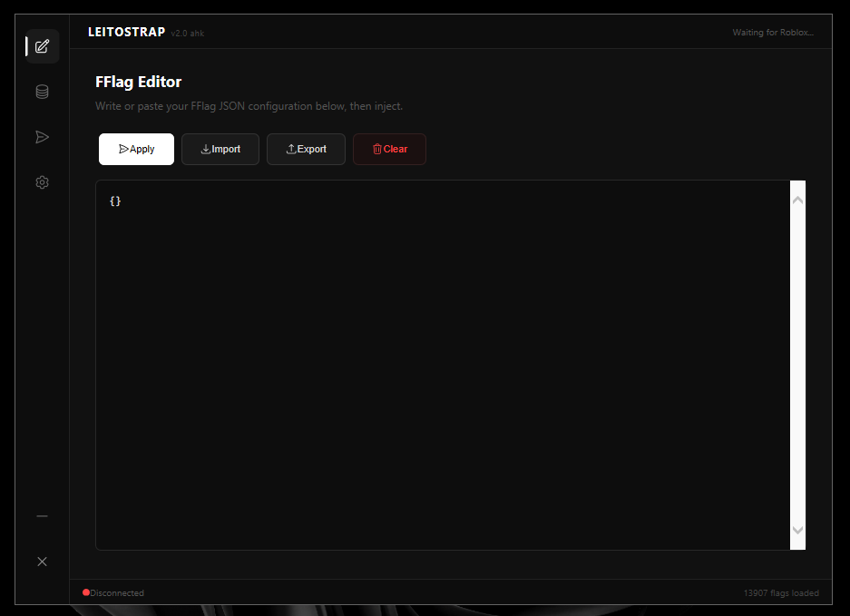

  
  <h1>Leitostrap AHK Injector</h1>
  
<i>A lightweight Roblox FastFlags injector built entirely in AutoHotkey v2 with live memory injection.</i>

  <a href="https://leitostrap.netlify.app/">Website</a> · 
  <a href="https://github.com/Leitostrap/Leitostrap-AHK/releases/latest">Latest Release</a> · 
  <a href="https://discord.gg/Fgec4NtHnu">Discord</a> · 
  <a href="https://github.com/Leitostrap/Leitostrap-AHK">Source Code</a>

    

  
  
  

   

  <i>Leave a star if you like the project! ⭐</i>

---

---

## Features

### Injection Engine
- **NtWriteVirtualMemory** — Direct memory writes via ntdll.dll. No VirtualProtectEx, no Hyperion/Byfron detection
- **NtSuspendProcess / NtResumeProcess** — Process is frozen during injection to prevent race conditions and crashes
- **NtFlushInstructionCache** — Flushes instruction cache after writing 4+ byte values
- **FFlagLimiter** — 60+ flag-specific safety limits that auto-clamp dangerous int/float values to prevent Roblox crashes
- **Persistent Reapply** — Optional timer (500-3000ms) that re-applies flags if Roblox reverts them. Off by default, configurable in Settings
- **Prefix Stripping** — Automatically strips common FFlag prefixes (DFString, FInt, DFFlag, etc.) for clean key matching
- **Live Offsets** — Auto-downloads fresh offsets from offsets.imtheo.lol. No disk cache, always up-to-date

### FFlag Editor
- Write or paste JSON directly into the editor
- **Import** — Load JSON files from disk
- **Export** — Save editor contents to JSON
- **Clear** — Reset the editor
- Automatic prefix detection and type inference (bool, int, float, string)

### Offset Database
- Live download from `imtheo.lol/Offsets/FFlags.hpp`
- Click any flag in the database to add it to the editor
- Search/filter by flag name
- **Add All Filtered** — Bulk add all matching flags
- Auto-classifies flags as INT, BOOL, or STR based on name patterns

### Injection Monitor
- Real-time stats: Applied, Failed, Reapplied, Active Flags
- Injection details panel showing method, persistence status, and last inject time
- Scrollable log with timestamps and color-coded entries

### Settings
- **Reapply Toggle** — Enable/disable flag re-application with custom interval (500-3000ms)
- **Value Limiter Toggle** — Enable/disable automatic value clamping
- Version info, engine type, offset count, and status display

---

## Why False Positives?

Leitostrap uses Windows Native API (`ntdll.dll`) to read and write process memory. These are the same APIs used by legitimate tools like Cheat Engine, x64dbg, and Process Hacker.

**Why it gets flagged:**
1. **Memory manipulation APIs** — `NtWriteVirtualMemory` is also used by malware
2. **No code signing** — Unsigned executables are treated as suspicious by SmartScreen

**There is NO malware, NO backdoor, NO data collection.** This is a 100% false positive common to all memory-editing software.

**Fix:** Add `Leitostrap.exe` to your antivirus exclusions, .ahk no needed add to exclusions.

---

## Requirements

- Windows 10/11
- AutoHotkey v2.0 (to run from source), or use .exe
- Roblox installed

---

## How to Use

1. Download `Leitostrap.ahk` or `Leitostrap.exe` from releases
2. Double-click to run (requires AutoHotkey v2.0), You don't need it if you have the .exe; it will open directly.
3. Wait for Roblox to be detected (green dot in status bar)
4. Enter your FFlag JSON in the editor
5. Click **Apply**

---

## Team

| Role | Name |
|------|------|
| **Owner** | Leito |
| **Developer** | Caiox |
| **Developer** | Prezone |
| **Developer** | Winnie |

### Special Thanks
- **Theo** (OWner Offsets)

---

## Links

- [Website](https://leitostrap.netlify.app/)
- [Discord Server](https://discord.gg/Fgec4NtHnu)
- [GitHub Repository](https://github.com/Leitostrap/Leitostrap-AHK)
- [Latest Release](https://github.com/Leitostrap/Leitostrap-AHK/releases/latest)
- [Offsets Source](https://offsets.imtheo.lol/fflags.hpp)

---

  Made with care by the Leitostrap team.

